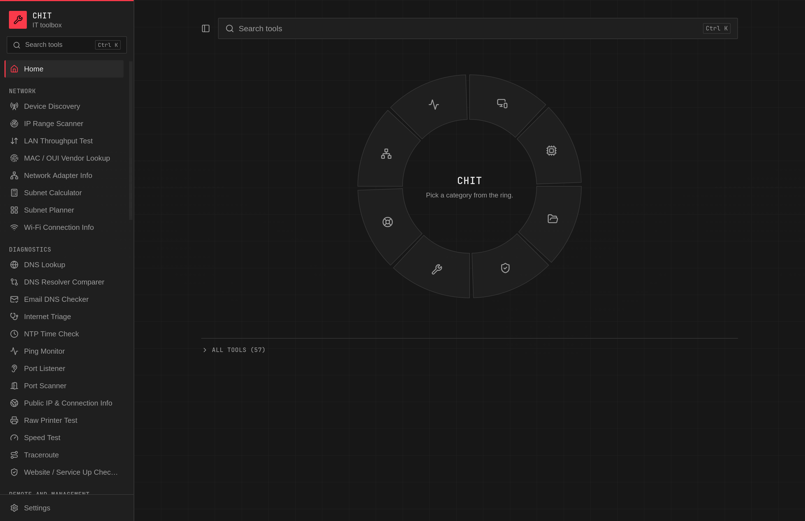

# CHIT

**Cyber Hub Information Tech**: the network and diagnostic tools an IT tech reaches for every day,
in one file you can double-click. No installer, no Python, no admin rights, no telemetry.

[](https://github.com/MitchTravis0/CHIT-Cyber_Hub_Information_Tech/actions/workflows/build.yml)
[](https://github.com/MitchTravis0/CHIT-Cyber_Hub_Information_Tech/releases)
[](LICENSE)




## Why

Most of what a field tech does in a day is a handful of small questions. Which addresses on this
subnet are free? Is the certificate about to expire? Is it the Wi-Fi or the internet? Answering them
usually means a folder of unrelated utilities, a browser tab full of websites you would rather not
paste a customer's data into, or a script you have to install a runtime for first.

CHIT puts **57 of those tools in a single executable**. It runs on Windows, macOS and Linux from the
same code, needs no administrator rights, and installs nothing: delete the file and it is gone,
which is what makes it work from a USB stick on a machine you do not own.

It is built so that somebody on their first week can use any tool without being told how. Every
result is written in plain sentences rather than error codes, and where an operating system will not
answer a question, the page says so instead of showing a blank.

## A few of them

| | |
| --- | --- |
| **IP Range Scanner** | Sweep `192.168.1.1-254` and see which addresses are free. Finds devices that ignore ping by trying common TCP ports and reading the ARP cache, and names the manufacturer behind every MAC. |
| **Internet Triage** | The whole "is the internet down?" checklist in order, stopping at the first thing actually broken: adapter, gateway, DNS, public address, a real request, captive portal. |
| **Port Scanner** | Tells open apart from closed apart from filtered, which is the difference between "the service is off" and "a firewall is eating it". |
| **Website / Service Up Checker** | HTTP status, redirect chain, where the time went, and the certificate expiry with days remaining. Catches the expired certificate before your users do. |
| **Log File Viewer** | Opens a multi-gigabyte log instantly, because only the part you are looking at is read. Follow mode is `tail -f` for Windows. |
| **Subnet Calculator and Planner** | The arithmetic, plus the other half nobody has: give it a block and a list of what must fit, and it carves it up largest first so the block does not fragment. |

Press `Ctrl+K` (`Cmd+K` on macOS) anywhere to search all 57 by name, by job, or by the command they
replace: `nslookup`, `ipconfig`, `tracert`, `netcat`.

<details>
<summary><b>All 57 tools, by category</b></summary>

### Network

| Tool | What it does |
| --- | --- |
| **Device Discovery** | Listens for the printers, TVs, NAS boxes and casting devices that announce themselves on the network (mDNS and SSDP), so you can find the one nobody wrote the address of down. Silence is not proof of absence and the page says so every time. |
| **IP Range Scanner** | Sweeps a range such as `192.168.1.1-254` and shows, address by address, which are in use and which are free. Finds devices that ignore ping by trying common TCP ports and then reading the ARP cache, and names the manufacturer behind each MAC it finds. Use it to pick a safe static IP or to track down a device that grabbed one from DHCP. |
| **LAN Throughput Test** | Measures the real transfer speed between this machine and another on the same network. The other machine needs only a browser. Tells you whether that run of cable is actually gigabit, and refuses to report a number when the link never left this machine. |
| **MAC / OUI Vendor Lookup** | Paste a MAC address and find out who made the device. The vendor database is built into the app, so it works with no internet connection, and it tells you when an address is randomized (modern phones and laptops) so you do not chase a name that will never exist. |
| **Network Adapter Info** | Everything `ipconfig` / `ifconfig` would tell you, laid out plainly: IP, subnet mask, gateway, DNS servers, DHCP or static, MAC address and MTU, per adapter, with the active one first. |
| **Subnet Calculator** | Type an IP and a mask in any common form and get the network, broadcast, first and last usable host, host count, wildcard mask and class. Also splits a network into smaller subnets. Handles IPv6, and the /31 and /32 special cases. |
| **Subnet Planner** | The other half of the subnet calculator: give it a block and a list of what has to fit ("Office PCs: 40, Printers: 12, Wi-Fi: 100, Link to branch: /30") and it carves it up largest first, so the block does not fragment. Shows each subnet's mask, usable range, broadcast and spare addresses, plus the whole blocks still free. Export the plan as a CSV for the build document. |
| **Wi-Fi Connection Info** | What the wireless is doing right now: network, band, channel, width, negotiated speed and signal strength. Settles "is it the Wi-Fi" and shows when a laptop has quietly parked itself on a congested 2.4 GHz channel. |

### Diagnostics

| Tool | What it does |
| --- | --- |
| **DNS Lookup** | Forward and reverse lookups (A, AAAA, CNAME, MX, TXT, NS, SRV, PTR) against several servers at once, so you can ask the domain controller and a public resolver the same question and compare. Says out loud when two servers disagree. |
| **DNS Resolver Comparer** | Ask the domain controller, your router and a public resolver the same question at once and see who disagrees. This is the fastest way to prove a stale or hijacked DNS answer rather than argue about it. |
| **Email DNS Checker** | Reads a domain's MX, SPF, DKIM and DMARC records and says in plain English what they actually allow, including the SPF lookup limit that silently breaks mail once you pass ten. For "why is our mail going to junk". |
| **Internet Triage** | The whole "is the internet down?" checklist in order, stopping at the first thing that is actually broken: adapter, gateway, DNS, a public address, a real web request, and whether a captive portal is intercepting you. Everything below the failure is marked "not checked" rather than guessed. Start here before you open anything else. |
| **NTP Time Check** | Compares this computer's clock against a time server and tells you whether the difference is enough to break Kerberos logins, which is five minutes. A wrong clock explains a surprising number of "it just stopped working this morning" tickets. |
| **Ping Monitor** | Watch up to four hosts continuously with a live latency graph, packet loss count and jitter. Leave it running while you wiggle the cable. Ping the gateway and something on the internet at once and you can see which side of the router the fault is on. |
| **Port Listener** | Opens a port on this machine so somebody at the other end can prove whether the firewall lets it through. A TCP client gets a line of text back and a UDP sender gets its datagram echoed, so the person testing sees proof on their own screen. The page prints the exact `Test-NetConnection` or `nc` command to run at the far end. |
| **Port Scanner** | Check which TCP ports answer on one machine, with one-click presets for web, remote access, Windows, printers, mail and databases. Tells open (something accepted the connection) apart from closed (the machine actively refused) and filtered (nothing came back at all), which is the difference between "the service is off" and "a firewall is eating it". |
| **Public IP & Connection Info** | The site's public address, ISP, ASN and rough location, on screen as soon as the page opens, with a copy button. For firewall rules, VPN peers, and checking whether the 4G failover actually kicked in. |
| **Raw Printer Test** | Sends a plain text page straight to a network printer's port 9100 with no driver installed, which separates "the printer is broken" from "the driver is broken" in about ten seconds. Asking the printer what it is and printing a page are two separate buttons, so nothing prints by accident. |
| **Speed Test** | A rough download, upload and latency check against Cloudflare, for sanity-checking "the internet is slow". Every number is labelled approximate, on screen. |
| **Traceroute** | Follow the path to a host hop by hop and see where it slows down or stops, with the biggest jump in response time flagged. Uses the system `tracert` / `traceroute`, so no admin rights are needed. |
| **Website / Service Up Checker** | Point it at a URL: HTTP status, redirect chain, where the time went (DNS, connect, TLS, server), and the certificate's expiry date with days remaining. Catches the expired certificate before your users do. |

### Remote and management

| Tool | What it does |
| --- | --- |
| **LAN File Drop** | Hand a driver or an installer to another machine on the same network with no USB stick: CHIT shows a link and a QR code, and the other machine opens it in any browser. It can take a file back too. This is plain HTTP on your local network with a random code in the link, so it is right for a driver and wrong for a payroll spreadsheet, and the link stops working the moment you press Stop. |
| **Saved Device Inventory** | The notebook page that does not get lost: what is at each site, what address it was given, and why. Fill it from a scan by exporting the IP Range Scanner's CSV and importing it here, or type devices in by hand. An import fills blanks and never overwrites a note you wrote, so running it again after the next scan is safe. Export a site as one JSON file to share with the team. |
| **Wake-on-LAN** | Wake a machine by MAC address, with a saved device list per site that you can export as a plain JSON file and share with the team. Sends to the right broadcast address, which is where most magic packets quietly go wrong. |

### System and bench

| Tool | What it does |
| --- | --- |
| **Battery Health** | How much of its original charge a laptop battery still holds, its cycle count and whether it is worth replacing. A figure above 100% is normal on a nearly new battery and the page explains why. |
| **Disk Space Visualizer** | Point it at a folder or a whole drive and it draws one box per subfolder sized by the space it uses, so the thing filling the disk is the big box. Click to go deeper, and use the breadcrumb to come back. Also lists the twenty-five biggest individual files, which is often the answer on its own. Nothing is ever deleted: it counts, you delete in Explorer where the recycle bin can save you. |
| **Disk Speed Test** | Measures how fast a drive, a USB stick or a network share really reads and writes, bypassing the operating system's cache so the number means something. For "is this disk dying" and "is the share the bottleneck". |
| **Installed Software List** | Everything installed on this machine with versions, exportable, without opening Programs and Features. On Windows it reads all three registry locations, so it finds the per-user installs the control panel hides. |
| **Keyboard and Input Tester** | Hand the laptop to the user, ask them to press every key once, and read the result: keys stay green after they have reported. Settles "is the keyboard broken or is it the PC" in thirty seconds, tells a dead key apart from a wrong keyboard layout, and spots a stuck modifier or Sticky Keys. Tests the mouse buttons, double-clicks and scroll wheel too. |
| **Listening Ports** | What is listening on this machine, on which address and port, and which program owns it. Separates the ports that are only reachable from this machine from the ones open to the whole network, which is the answer to "what is using 8080". |
| **Startup and Services Viewer** | Everything set to launch when the machine starts or you sign in, plus every configured service, including the Windows Run keys that Task Manager does not show. Flags entries worth a second look (a program running from a temp folder, a script instead of a program, a hidden PowerShell command) as a hint, never a verdict. Read only: it tells you what to go and change, it cannot change it. |
| **System Info Snapshot** | The machine you are standing at, on one screen: operating system and build, model, serial number, processor, memory fitted and free, uptime, and every drive with how full it is. Drives past 90% are flagged, because that is usually the real answer to "the computer is slow". Copy the whole thing into a ticket with one button. Anything your operating system will not hand over without admin rights says so plainly rather than showing a blank. |
| **USB Device History** | The USB devices plugged in now, with the vendor and product ID Device Manager hides three clicks deep, which is what you paste into a search when Windows says "Unknown device". On Windows it also lists storage devices seen previously, with serial numbers and first-connected dates. macOS and Linux keep no such record and the page says so. |

### Files and data

| Tool | What it does |
| --- | --- |
| **Bulk File Renamer** | Rename every file in one folder by a rule (find and replace, numbering, prefix or suffix), with a full before-and-after preview before anything is touched, and an undo afterwards. |
| **CSV / JSON Viewer and Converter** | Open a CSV or JSON export and read it as a sortable table instead of raw text, then convert between the two formats. |
| **Duplicate File Finder** | Finds files whose contents are identical, whatever they are called, so `Report.docx` and `Report (1).docx` only show up if they really are the same file. Works in three passes so it does not have to read your whole drive, and reports the biggest wins first. It never deletes anything. |
| **File Hash Checker** | Get the MD5, SHA-1 and SHA-256 of a file and paste in the value the vendor published to see whether they match. Streams the file, so a multi-gigabyte ISO does not freeze the app. |
| **Log File Viewer** | Opens a multi-gigabyte log instantly, because only the part you are looking at is read. Jump to the end, page through it, search the whole file, and turn on Follow to watch new lines arrive, which is `tail -f` for Windows. Error and warning lines are tagged and tinted. |
| **Text Diff** | Paste or open two versions of a config, a GPO export or a switch running-config and see exactly which lines changed. Long runs of identical lines are folded away, so a 900 line config with two changes shows about a dozen rows. Copy just the changed lines into the ticket. Nothing is saved, because what goes in here is usually a customer's configuration. |

### Security

| Tool | What it does |
| --- | --- |
| **Certificate & CSR Generator** | Make a self-signed certificate for a NAS, a switch GUI or an iDRAC, or a signing request for a real certificate authority, without remembering an openssl incantation. The name you type is added as a subject alternative name automatically, because browsers stopped reading the common name years ago. The private key is generated on your machine, shown once and never saved by CHIT. |
| **Certificate Decoder** | Paste a certificate or open a `.pem` / `.crt` / `.cer` / `.der` file and read it in plain terms: who it was issued to, who signed it, every name it covers, when it expires, and the chain it came with. Nothing is sent anywhere, so it is safe for internal certificates. |
| **Password Strength / Breach Checker** | Rate a password's strength and check whether it has appeared in a known data breach. The breach check uses Have I Been Pwned's k-anonymity API: a few characters of a hash leave your machine, the password itself never does. |
| **Phishing Link Inspector** | Paste a suspicious link and see where it really ends up before anyone clicks it. Unwraps shorteners and Safe Links wrappers, follows the redirect chain, and flags look-alike tricks such as punycode domains. |
| **TLS Handshake Prober** | Finds out which TLS versions and ciphers a server will actually accept, which is what an auditor asks and what a legacy device needs. SSL 3.0 is listed as not testable, with the reason, rather than faked. |
| **TOTP Code Generator** | Two-factor codes for accounts the team shares, such as the firewall's admin login, kept in a file encrypted with a passphrase. Big codes you can read at arm's length, with a countdown. The vault locks itself after fifteen minutes. Add accounts by pasting the `otpauth://` link the service shows next to its QR code. Not for your own personal accounts: those belong on your own phone. |

### Utilities

| Tool | What it does |
| --- | --- |
| **Cron Explainer** | Paste the cron line from a NAS or a backup agent and read it in plain English, with the next five run times in your own clock. Warns about the two things that catch everyone: setting both the day of the month and the day of the week (cron reads that as "or", not "and"), and a step like `*/7` that restarts every hour instead of running every 7 minutes. Build an expression from dropdowns if you would rather go the other way. |
| **Password Generator** | Generate strong random passwords or word-based passphrases, with the exact strength in bits. Runs entirely on your machine. |
| **Screen Ruler and Color Picker** | Measure in pixels inside the window, and read this display's real resolution, scaling and colour depth, which is what settles "everything is huge on the new monitor". Pick colours out of an image you open or paste (take a screenshot first: no app can read pixels outside its own window), with hex, RGB and HSL and a contrast check. |
| **Text Encoder / Decoder** | Base64, URL percent-encoding, hex and HTML entities, in both directions, plus a read-only JWT decoder for looking inside a token. |
| **Wi-Fi QR Code Generator** | Type an SSID and password and get a QR code guests scan to join the network; also turns any link into a code. The QR encoder is built into the app, so your Wi-Fi password is never sent anywhere. |

### Helpdesk

| Tool | What it does |
| --- | --- |
| **IT Reference Cards** | The lookups you normally google from a basement with no signal: RJ45 T568A and T568B pinouts drawn with the colours named, common port numbers, HTTP status codes, Wi-Fi channels and which ones are DFS, a subnet cheat table, PC beep codes and what each number of nines actually allows in downtime. Search all seven cards at once, or press Ctrl+K and type `568b`. |
| **Label Maker** | Printable equipment labels with an asset tag, a hostname, an address and a QR code, laid out for common Avery sheets and Brother or DYMO rolls. Print through your normal print dialog (which is where "Save as PDF" lives) or download one label as a PNG. Print one page on plain paper first and hold it against the sheet. |
| **Phonetic Alphabet Converter** | Turn a serial number, licence key or password into a NATO alphabet readout ("Alfa Bravo Charlie") you can say down the phone without the S-or-F confusion. |
| **Shared Snippet Library** | The team's cheat sheet: commands with awkward switches, registry paths, canned replies to users, each one click from the clipboard. Comes with a starter set you can edit or delete. Export it as one file so everybody carries the same one. CHIT never runs a snippet, it only copies text. |
| **Site Checklist Runner** | Work through a build, an office move or a decommission and tick items off as you go, with a note against each. Starting a run copies the checklist as it is right now, so improving the procedure later never rewrites a job you already did. Copy the finished run out as a dated record for the ticket. |
| **Ticket Note Formatter** | Keep timestamped notes while you work, then copy the whole thing out as a tidy write-up with the issue, every step you took and the resolution, in plain text or Markdown. Nothing is sent to any ticket system; it produces text you paste. |
| **Warranty / Serial Lookup Helper** | Type a service tag and it opens the right vendor's warranty page with the serial already in the link. Guesses the vendor from the shape of the serial. For HP and Microsoft, whose pages will not take a serial in a link, it opens the page and puts the serial on your clipboard instead, and says so. The vendor links are editable, so a vendor changing their address is a five-second fix. |

</details>

## Privacy and what touches the network

CHIT is built for machines you are responsible for, so it is explicit about what leaves them.

- **Nothing is sent anywhere you did not ask about.** No telemetry, no analytics, no crash
  reporting, and no background requests of any kind.
- **The update check runs only when you press the button** in Settings, and only asks GitHub for
  the latest release number. Installing an update is a second, separate button: nothing is
  downloaded until you press it, the download must match the checksum the release publishes or
  nothing is replaced, and CHIT never checks or installs on its own.
- **Tools that must reach the internet say so on the page** and name the service before you press
  anything: Cloudflare for the speed test, `ipinfo.io` for the public address, Have I Been Pwned for
  the breach check (which uses k-anonymity, so only the first five characters of a hash leave the
  machine, never the password).
- **Certificates, passwords, QR codes and hashes are all computed locally.** Nothing you paste into
  the decoder, the generator or the encoder is transmitted.
- **Three tools accept an incoming connection**, and only while you have them running: LAN File Drop,
  Port Listener and LAN Throughput Test. Each shows a Stop button the entire time it listens and
  releases the port the moment you press it. Nothing in CHIT listens otherwise.

Nothing CHIT does requires administrator or root. Where a feature would need elevation it degrades
and labels itself rather than asking.

## Download and run

Grab the file for your computer from the
[Releases page](https://github.com/MitchTravis0/CHIT-Cyber_Hub_Information_Tech/releases), then follow the three lines for your
operating system. There is no installer and nothing gets added to your system: delete the file and
CHIT is gone.

### Windows

1. Download `chit-windows-amd64.exe`.
2. Double-click it.
3. That is it. Keep it in Downloads, on your desktop, or on a USB stick.

**"Windows protected your PC"**: the first time you run it, Windows SmartScreen may show a blue box
saying the app is unrecognised. Click **More info**, then **Run anyway**. Windows only asks once per
machine.

This is expected rather than a fault: **CHIT ships unsigned.** Code-signing certificates are an
annual cost this project does not currently carry, and even a signed binary shows the same warning
until it has built SmartScreen reputation. The same applies to macOS notarisation below.

If you would rather not take that on trust, **build it yourself** from source in about a minute
(see below) and compare, or check the CI run that produced the release: every binary on the
Releases page is built by the public workflow in this repository from the tagged commit, not
uploaded from anyone's laptop.

### macOS

1. Download `chit-macos-universal.zip` and double-click it to unzip.
2. Drag `chit.app` to your Applications folder (or leave it where it is).
3. **Right-click the app and choose Open**, then click Open in the dialog.

Use right-click Open the first time rather than a normal double-click. macOS blocks unsigned apps
opened the usual way, and the right-click route gives you the "open anyway" button. After the first
launch it opens normally.

### Linux

1. Download `chit-linux-amd64.tar.gz` and extract it (`tar -xzf chit-linux-amd64.tar.gz`).
2. Make it executable if your file manager has not: `chmod +x chit`.
3. Run it.

**One dependency**: Linux needs the WebKit library that draws the window. Most desktop installs
already have it. If CHIT will not start, install it:

| Distribution | Command |
| --- | --- |
| Ubuntu 24.04+, Debian 13+ | `sudo apt install libwebkit2gtk-4.1-0` |
| Fedora | `sudo dnf install webkit2gtk4.1` |
| Arch | `sudo pacman -S webkit2gtk-4.1` |

### The firewall prompt

The first time you use the IP Range Scanner, Windows (and some Linux firewalls) will ask whether to
let CHIT communicate on the network. **Allow it on private networks.** The scanner cannot see
anything without it.

Almost every tool only ever makes outgoing connections: pings and short connection attempts to the
addresses you asked it to check. **Three are the exception**, and each one only while you have it
running:

- **LAN File Drop** serves the files you picked, behind a random code in the link, on a port you
  choose (8722 by default), so the other machine's browser can reach it.
- **Port Listener** opens a port on purpose so somebody at the far end can prove the firewall lets
  it through.
- **LAN Throughput Test** serves a generated stream so another machine can measure the link speed.

Each shows a Stop button the whole time it is listening and releases the port the instant you press
it. **Nothing in CHIT listens when those three are not running.** The welcome tour on first launch
says the same thing.

Nothing CHIT does needs administrator or root. If your network blocks ping, the scanner quietly
falls back to TCP probes and the ARP cache and tells you what it used.

## The welcome tour, and checking for updates

The first time you open CHIT it shows a five page welcome tour: how to find a tool, favourites and
recents, the three tools that open a port, and where your data lives. It never appears again. You
can bring it back from **Settings > Help > Show the tour**.

Settings also has a **Check for updates** button. It asks GitHub whether a newer release exists
and, if there is one, offers to install it: press **Install**, CHIT downloads the release for your
machine, checks it against the checksum the release publishes, and swaps it into place. Nothing
changes if any step fails, and the version you were running is put back if the swap itself goes
wrong. Restart when you are ready, or keep working; the new version takes over the next time CHIT
starts. **CHIT never checks or installs on its own**: there is no background request, so handing
the executable to a colleague on a customer network does not quietly add traffic. If CHIT cannot
update itself where it is (a folder it may not write to, a machine its releases do not cover), it
says so in one sentence and links you to the download page instead; it never asks for
administrator rights.

## Where CHIT keeps its settings

Your theme, favourites and per-tool preferences live in a small folder of JSON files:

- Windows: `%APPDATA%\chit`
- macOS: `~/Library/Application Support/chit`
- Linux: `~/.config/chit`

For a fully portable copy (settings travel with the executable, nothing written to the rest of the
machine), put an empty file named `portable.txt` next to the executable. CHIT then keeps everything
in a `data` folder beside itself, which is what you want on a USB stick. The Settings page shows the
folder in use and whether portable mode is on.

## Project status

**v1.0.** All 57 tools are built, and the test suite covers the parsing, arithmetic and decision
logic behind them, with golden files shared between the Go and TypeScript sides so the two cannot
drift.

Being straight about coverage, because it matters for a tool like this: **Linux is the platform it
has had the most real use on.** The Windows and macOS binaries are built from the same source and
run through the same CI pipeline, but they have seen far less time in front of real hardware,
particularly the Windows-specific halves of the system tools (registry reads, service enumeration,
USB history, `netsh wlan`). If you hit something on those platforms, an issue with the tool name and
what you expected is genuinely the most useful thing you can send.

Two tools are honest about permanent limits rather than pretending: the Screen Ruler cannot read
pixels outside the app's own window (no webview can), and USB Device History can only show
previously-connected storage on Windows, because macOS and Linux keep no such record.

## Contributing

Issues and pull requests are welcome. The most valuable contributions right now are bug reports from
Windows and macOS, and tools you actually reach for that are not here yet.

If you want to add a tool, the shape is deliberately small: one entry in
`frontend/src/tools/registry.ts`, one folder at `frontend/src/tools/<id>/` with a default-exported
React component, and optionally one Go package under `internal/tools/` with a thin `app_<tool>.go`
binding. The sidebar, home screen, command palette and routing all read from that registry.

Read these first, because nearly everything is already built for you: `internal/core` (the job
engine, worker pool and error codes), `internal/store` (namespaced JSON persistence),
`frontend/src/components/` (`ToolShell`, `ResultsTable`, `Button`, `Textarea` and friends) and
`frontend/src/lib/useJob.ts`. `internal/tools/ipscan/` with `frontend/src/tools/ip-range-scanner/`
is the reference for a streaming, cancellable job; `app_mac.go` with
`frontend/src/tools/mac-lookup/` for a simple request and response.

Three house rules worth knowing before you open a PR:

1. **No new dependencies** without discussing it first. The whole point is one small binary.
2. **Never fork a shared component.** If `ResultsTable` or `ToolShell` cannot do what you need, say
   so in the issue and it gets fixed once for everybody.
3. **Error messages are written for a junior tech**, in full sentences that say what happened and
   what to do about it. No error codes, no raw library text.

## Building from source

You need Go 1.25 or newer, Node 24 or newer, and the Wails CLI. Node 24 is the real floor: the
frontend tests run TypeScript directly on Node's built-in test runner, which earlier versions do not
strip types for.

```bash
go install github.com/wailsapp/wails/v2/cmd/wails@v2.13.0
```

`go install` puts the CLI in `$(go env GOPATH)/bin`, normally `~/go/bin`. Add that to your `PATH`,
or call `~/go/bin/wails` directly. If Go itself is not on your `PATH` either (for example a manual
install under `~/.local/go`), start with:

```bash
export PATH=$HOME/.local/go/bin:$HOME/go/bin:$PATH
```

Then, from the repo root:

```bash
wails dev                      # live-reloading development build
wails build -clean             # production build into build/bin/
```

**On Linux you must add the webkit tag**, because current distributions ship webkit2gtk-4.1 while
Wails defaults to the older 4.0:

```bash
wails build -clean -tags webkit2_41
wails dev -tags webkit2_41
```

You also need the development headers: `libwebkit2gtk-4.1-dev` and `libgtk-3-dev` on Debian and
Ubuntu, `webkit2gtk-4.1` and `gtk3` on Arch.

`wails build` writes the executable to `build/bin/`, so run your local build with:

```bash
./build/bin/chit
```

`wails dev` opens the desktop window and reloads on save. It also serves the same app in your browser
at `http://localhost:34115`, where the Go methods are still callable and you get normal browser
developer tools. Debugging the UI there is far easier than inside the desktop webview.

### Checks

```bash
go vet ./...
go test ./...                  # add -short to skip the tests that need a real network
cd frontend && npx tsc --noEmit && npm test
```

`npm test` runs the frontend suites on Node's own test runner (Node 24 or newer, no extra
dependency). They cover the arithmetic the app does in the browser: the subnet calculator and the
scanner's range parsing, grid and free-block maths.

Note that `main.go` embeds `frontend/dist`, so on a fresh clone run `cd frontend && npm ci && npm run
build` once before any `go` command.

## Licence

MIT. See [LICENSE](LICENSE).

The bundled MAC vendor database is derived from the IEEE registry as republished by Wireshark; see
[internal/ouidb/SOURCE.md](internal/ouidb/SOURCE.md) for provenance and how to refresh it.
